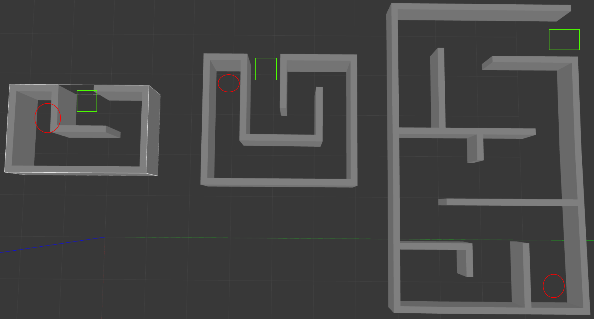

Description: We are given 3 maps. We need to start at one end (marked red) and end at the other (marked green). We are rewarded for quickest time, not shortest distance. 

# Final Project Sai part 2
Create lidar based bouandaries, if we touch the walls we die. create bound box circle, nothing should get closer. 

We are starting in the far corner. 

# Final Project Sai (overcomplicated)
This is essentially a tree traversal problem. Abrar clarified having states and specifc angle instructions at those states in not cheating. So we consider what path makes the most sense from the models provided. Then we instruct the robot to go forward until it reaches a new node, then it turns, then it keeps going forward, then it turns, until it reaches the end. We use the lidar to keep track of the obstace in the direction were headed and the direction the next node is. One of the bottlenecks for our system is speed, especially at corners. TLDR the shortest distance isn't necessarily the fastest time, and the highest robot speed isn't the fastest either. Three obvious solutions are [go forward; stop at obstacle; full 90 degree turn; go forward], [go forward; stop well before obstacle; 45 degree turn; go forward (hypotenuse); stop; 45 degree turn; go forward], or [go forward; make quarter circle arc; at 90 go forward]. This isn't every possibility. As I write this I don't want to do the math, and we'll probably have to adjust for real world variables. 

The critical components will be our path planning (above), pose estimation (x,y,z,yaw,pitch,roll), and a control loop (where are we, where do we want to be, adjust). We will need to make our own encoder based odometry package (we can't use the one provided) and we'll have to make our own PID loop. Neither should be too hard theoretically, but implemetaion might be a pain. One fun thing we can do is pose adjustment with our lidar and a state estimator like a kalman filter. We can generate a "vision pose" from the pointcloud that we also pipe into the kalman filter and it applies a correction for improved pose estimation. Now I doubt the maze is big enough and the lidar acurate enough for this to ever matter, but it is still a fun thought. 

There is a chance that this behavior tree style model will be flagged as hardcoding. One idea (which Ishan I think thought of somehting similar for lab 3) is at any point, reduce directions into 3 choices, forwards, left, or right, . At any moment pick the direction that is farthest away. Turn towards that direction and go forward, keep repeating while going forward, not while turning. We would need a protection to prevent the robot from turning, getting a new backwards and the old backwards suddently becomes the furthest away. This algorithm works because of how the mazes are built, it is typically a terrible idea. CMSC451 would call this a "greedy algorithm," in that it solves the problem by selecting a characteristic and maximizes it. In maze 3, there are actually 3 points where the wrong direction is nearly equal to the current direction, so there would need to be a check that the direction is a certain threshold greater just in case.

# Final Project Soha & Ishaan
Wall following, non optimal. We need shortest path and raw wall follow misses that. 

# Final Project Soha & Ishaan & Sai
Wall following but with all 4 directions (robot_cardinal). Operate with states. At each state trigger a turn. The trigger condition is being debated, should we use all 4 directions or just one for wall follow. All 4 is more fundemental to do, and we can abstract with Sai's lidar package idea. 
Simplifying to 4 directions opens us up to variations in lidar. We shouldn't seek odom off the top because it overcomplicateds, and obviously lidar for imu data is inherantly and overcomplication. 
No more timers. Timers are hardcoding essentially. 

# Lab 3
Sai: The easiest idea is to act in "states" so to say. Easiest implementation would use a match statement. State 1 would go forward and read the front facing values until we are 5cm from the wall. Then trigger State 2. State 2 will turn 90 degrees left in place, then trigger state 3. State 3 will repeat State 1. State 4 will turn 90 degrees right in place. State 5 reaches the end. This is not hardcoding. We know the map already.

Freidrich: Look left/right and follow it to the end. Maintain didstance from wall. 

Ishan: Maximize distance. 

